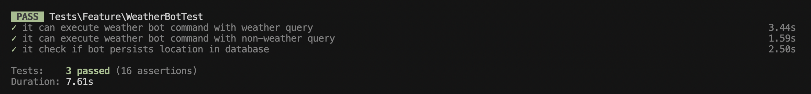

## Weather Bot

A simple AI Weather Bot built with Laravel, Prism, OpenAI and Weather/IP APIs.

### Demo Video

[Watch the demo video here.](https://www.loom.com/share/1c99468fc8754b59b7db991592568a99?t=13&sid=11df8801-302e-48f1-a2d1-af05c70147cb)

### Prerequisites

Tested on the following versions using Windows 11:

```yaml
php: 8.2.12
composer: 2.8.9

nodejs: 20.19.4

laravel: 12
```

### How to setup

1. Clone repository `git clone ...`
2. Enter the repository using `cd weather-bot`
3. Install packages using `composer install`
4. Setup env using `cp .env.example .env`
5. Create a MySQL database called `weather_bot`
6. Update the `.env` variables with the right configuration
7. Add your `OPENAI_API_KEY` in the `.env` at the end.
8. Run the DB migrations using `php artisan migrate`
9. Run `php artisan key:generate` to generate a new app key
10. Since `SESSION_DRIVER=database` is set in `.env`, run `php artisan session:table` and `php artisan migrate`
11. Run `php artisan serve` and visit http://localhost:8000/

#### Sample DB Connection

```
DB_CONNECTION=mysql
DB_HOST=127.0.0.1
DB_PORT=3306
DB_DATABASE=weather_bot
DB_USERNAME=[username]
DB_PASSWORD=[password]
```

### Feature Tests



### Run the CLI

```bash
php artisan app:weather-bot
```

To run the AI Weather Bot, please go to the terminal and run `php artisan app:weather-bot`. Here, you can ask the question, [What is the weather in my location?] If the location is not persisted already, it will ask you for the location and return the weather in Celcius. Next time you run the same Artisan command, you can simply ask, [What is weather like in my area] and it will return the weather swiftly.

#### Focus on [`WeatherBot.php`](app\Console\Commands\WeatherBot.php) for code details.

### What did I not implement intentionally

1. The ability for the bot to continue running even after its job has been completed.
2. The ability to judge the location using the geolocation API instead of requesting it.
3. The ability to perform more tests in the fashion that Prism docs have outlined.

### What the next developer should build

1. The next developer can work on the aforementioned points in earlier section.
2. The next developer can modularise the code further for easy extensibility.
3. The next developer can also handle edge cases better.

### Where can the code be extended

The code can be extended at multiple levels, for example, someone working on this further would add LLM Provider fallbacks, in case there is an API downtime on the default model. Another thing that could be done is finding an API service that returns the weather temperature just by city name, without having to get coordinates first, which would actually improve the response time of this chatbot. Currently two API calls are made to get the weather temperature for a city.

### Any design decisions or caveats

I have made sure that the bot only works for weather related queries, through employment of a strict prompt guideline. So non-weather related questions will return a canned response. However, there is a caveat, whereby the bot also works if you have a persisted location of London and you ask a different question such as 'What is the weather in Dome A?' and it actually returns the response for both locations.
